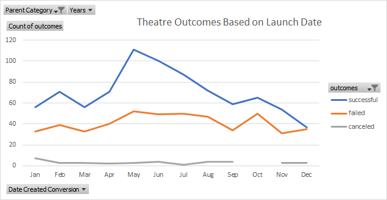

# Kickstarting with Excel

## Overview of Project
Kickstarter campaigns were created to raise funds for a play. They quickly met the fundraising goals. This project uses excel to create visualization of kickstarter data of these fundraising campaigns.

### Purpose

Visualization of campaign data to look at fundraising outcomes association to launch dates and funding goals for category theater and subcategory of plays.

## Analysis and Challenges

### Analysis of Outcomes Based on Launch Date
From the chart we see that best time to campaign for Theatre category is May and then second best is June. December is the least successful month for campaigns. 

### Analysis of Outcomes Based on Goals
Let's look at the highlighted cells in the table below. 

As you will see the greatest success rate for outcomes (76%) is for Goal of less than $1000. But it is also apparent that only 18% of plays had goal of less than $1000.

The success rate for Goal between $1000-$4999 is only slightly less (73%) but it is also notable that this category of goal has highest number of plays (51%). 

So even though the success rate for Goal of under $1000 is higher, a play with goal of $1000 to $4999 also has a fair chance of being successful.

### Challenges and Difficulties Encountered
The most challenging part for me in module 1 was to determine which outcome was more successful. Whether it was the absolute number (388 out of 534) for Goal 1000 to 4999 or was it for Goal less than 1000 that had most success rate of 76%.
I did some internet reading about absolute and relative numbers and figured out that I would draw the conclusion based on both numbers in this context.

## Results

**- What are two conclusions you can draw about the Outcomes based on Launch Date?**
From the data it is clear that the theater campaigns in the month of May are most successful where as the ones in December are the least successful. 

**- What can you conclude about the Outcomes based on Goals?**
The most successful campaigns has goal of $1000 or less.

**- What are some limitations of this dataset?**
Some limitations that I can think of this dataset are:
1. Within countries, there is no data to understand if any particular region where the most donations were coming from. This would have helped Louise focus on particular regions rather than entire country.
2. It is hard to know from just number of backers to understand how the donations are distributed. Was it that one backer contributed big portion of the donation? 
3. A Profile of big backers would have helped to understand what motivates them to donate large sum of money. 

**- What are some other possible tables and/or graphs that we could create?**
1. It would be interesting to see if Staff_Pick had any effect on the campaing being successful or not. 
2. It would also help if we could see how the campaigns fared in different countries.
